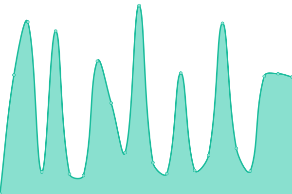
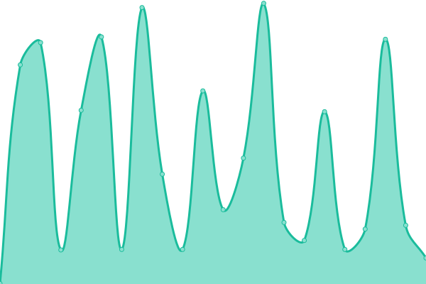
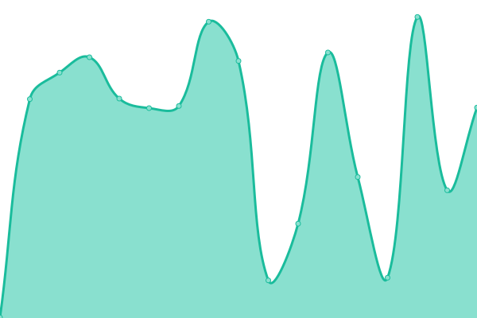
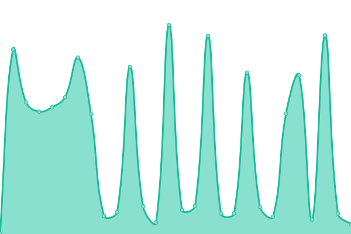

# [📈 Live Status](https://status.doctor-versum.me): <!--live status--> **🟧 Partial outage**

This repository contains the open-source uptime monitor and status page for [Tobias](doctor-versum.github.io), powered by [Upptime](https://github.com/upptime/upptime).

With [Upptime](https://upptime.js.org), you can get your own unlimited and free uptime monitor and status page, powered entirely by a GitHub repository. We use [Issues](https://github.com/doctor-versum/upptime/issues) as incident reports, [Actions](https://github.com/doctor-versum/upptime/actions) as uptime monitors, and [Pages](https://status.doctor-versum.me) for the status page.

<!--start: status pages-->
<!-- This summary is generated by Upptime (https://github.com/upptime/upptime) -->
<!-- Do not edit this manually, your changes will be overwritten -->
<!-- prettier-ignore -->
| URL | Status | History | Response Time | Uptime |
| --- | ------ | ------- | ------------- | ------ |
|  [Homepage](https://doctor-versum.me) | 🟥 Down | [homepage.yml](https://github.com/doctor-versum/upptime/commits/HEAD/history/homepage.yml) | 

 349ms
     
 | 

<a href="https://status.doctor-versum.me/history/homepage">53.55%</a>
    

|  [Homepage (Redirect)](https://www.doctor-versum.me) | 🟥 Down | [homepage-redirect.yml](https://github.com/doctor-versum/upptime/commits/HEAD/history/homepage-redirect.yml) | 

 357ms
     
 | 

<a href="https://status.doctor-versum.me/history/homepage-redirect">55.90%</a>
    

|  [QuizzX](https://quizzx.doctor-versum.me) | 🟥 Down | [quizz-x.yml](https://github.com/doctor-versum/upptime/commits/HEAD/history/quizz-x.yml) | 

 351ms
     
 | 

<a href="https://status.doctor-versum.me/history/quizz-x">64.90%</a>
    

|  [Share](share.doctor-versum.me) | 🟥 Down | [share.yml](https://github.com/doctor-versum/upptime/commits/HEAD/history/share.yml) | 

 301ms
     
 | 

<a href="https://status.doctor-versum.me/history/share">64.89%</a>
    

|  Rammerhead | 🟥 Down | [rammerhead.yml](https://github.com/doctor-versum/upptime/commits/HEAD/history/rammerhead.yml) | 

 290ms
     
 | 

<a href="https://status.doctor-versum.me/history/rammerhead">64.71%</a>
    

|  Survey | 🟥 Down | [survey.yml](https://github.com/doctor-versum/upptime/commits/HEAD/history/survey.yml) | 

 285ms
     
 | 

<a href="https://status.doctor-versum.me/history/survey">100.00%</a>
    

|  [GitHub](https://GitHub.com) | 🟩 Up | [git-hub.yml](https://github.com/doctor-versum/upptime/commits/HEAD/history/git-hub.yml) | 

 361ms
     
 | 

<a href="https://status.doctor-versum.me/history/git-hub">100.00%</a>
    

|  [Status](https://status.doctor-versum.me) | 🟩 Up | [status.yml](https://github.com/doctor-versum/upptime/commits/HEAD/history/status.yml) | 

 310ms
     
 | 

<a href="https://status.doctor-versum.me/history/status">0.00%</a>
    

<!--end: status pages-->

[**Visit our status website →**](https://status.doctor-versum.me)

## 📄 License

- Powered by: [Upptime](https://github.com/upptime/upptime)
- Code: [MIT](./LICENSE) © [Anand Chowdhary](https://anandchowdhary.com), supported by [Pabio](https://pabio.com)
- Data in the `./history` directory: [Open Database License](https://opendatacommons.org/licenses/odbl/1-0/)
